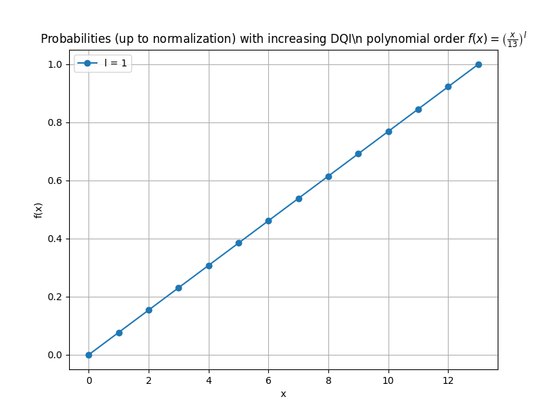

Performance Visualizations
==========================

This page showcases various performance metrics and visualizations for the mohituQ algorithms.

DQI Algorithm Performance
------------------------

   
   Performance benchmarks for the DQI algorithm on Max-XORSAT problems

The above chart shows how the DQI algorithm performs on various problem sizes.

Metrics Explained
---------------

* **Success Rate**: The percentage of runs where the optimal solution is found
* **Time to Solution**: The average time required to find the optimal solution
* **Quantum Advantage**: The speedup compared to classical solvers

For more detailed analysis, please see our research papers referenced in the Acknowledgments section. 