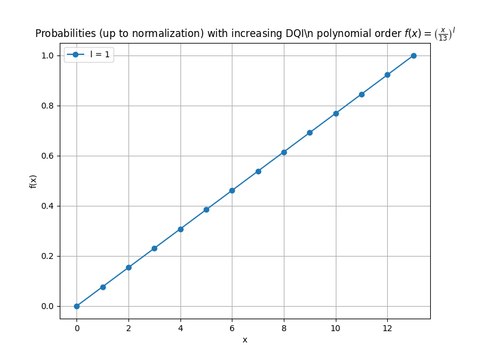

.. _demo:

Demo Resources
=============

This section contains demonstration resources for understanding and visualizing the quantum algorithms used in the mohituQ project.

.. toctree::
   :maxdepth: 2
   :caption: Demo Contents:

   Hardcoding_maxxorsat.ipynb
   decoding.ipynb
   performance_visualizations

Jupyter Notebooks
----------------

Hardcoding_maxxorsat.ipynb
^^^^^^^^^^^^^^^^^^^^^^^^^^

A manual implementation of the Max-XORSAT problem solution using quantum circuits.

.. note::
   This notebook demonstrates step-by-step circuit construction without using high-level abstractions.

**Key sections:**

* Manual circuit construction for the Max-XORSAT problem
* Implementation of core quantum operators 
* Visualization and analysis of results

decoding.ipynb
^^^^^^^^^^^^^

Demonstrations of quantum decoding techniques used in DQI algorithm implementation.

.. note::
   This notebook focuses on syndrome table construction and decoding strategies.

**Key sections:**

* Construction of syndrome tables for error correction
* Mapping between error patterns and their syndromes
* Practical examples of syndrome decoding

.. _performance_visualizations:

Performance Visualizations
-------------------------

   
   Performance benchmarks for the DQI algorithm on Max-XORSAT problems

Performance benchmarks for the DQI algorithm on Max-XORSAT problems of various sizes, showing how algorithm performance scales with problem complexity.

.. seealso::
   For implementation details, refer to :py:mod:`src.dqi_max_xorsat_implementation`.

Using These Resources
--------------------

To run the Jupyter notebooks:

1. Ensure you have all dependencies installed:

   .. code-block:: bash

      pip install -r requirements.txt

2. Launch Jupyter:

   .. code-block:: bash

      jupyter notebook

3. Navigate to the ``src/demo`` directory and open the desired notebook.

These demos complement the main implementations in the parent directory and provide educational insights into the algorithms. 